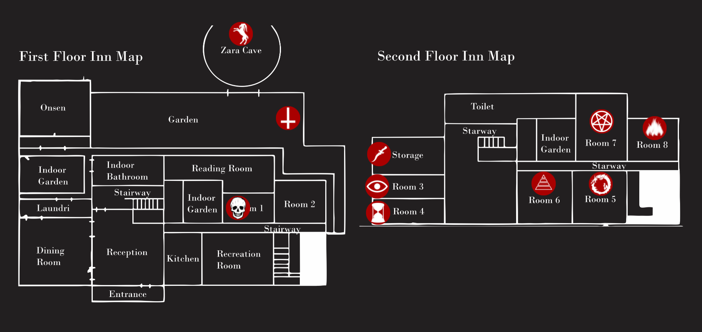

  

  <h3 align="center">Devour Map 🕷️</h3>

  

    A map to assist at Devour game
     
    <a href="https://brunovollin.github.io/devour-map/ "><strong>Open project  »</strong></a>
     
     
      &middot;
      <a href="https://github.com/BrunoVollin/devour-map/issues">Report Bug</a>
      &middot;
      <a href="https://github.com/BrunoVollin/devour-map/issues">Request Feature</a>
  

## About The Project
In The Inn, players must burn eggs on specific altars scattered across the map. Each altar has a unique symbol (e.g., eye, snake, star), and players must match the egg with the corresponding altar. However, the altar locations are random in every game, making it difficult to plan ahead. As more eggs are burned, the game becomes increasingly challenging. Players can use UV light to temporarily stun threats, but teamwork and quick decision-making are essential.

This project helps track and share the real-time location of altars, allowing players to coordinate more effectively, find the correct altars faster, and improve overall gameplay efficiency.

### How the website works

The user interacts with the front end of the web application, which serves as the interface for their actions. The front end establishes a WebSocket connection with a TypeScript-based API to enable real-time communication. This connection ensures that the positions of all pieces within the application are continuously updated and synchronized across all users in the same room. 

### Devour Map link 
https://brunovollin.github.io/devour-map/ 

### Game link on steam
https://store.steampowered.com/app/1274570/DEVOUR/

## License

This project is licensed under the MIT License - see the [LICENSE.txt](LICENSE.txt) file for details.
